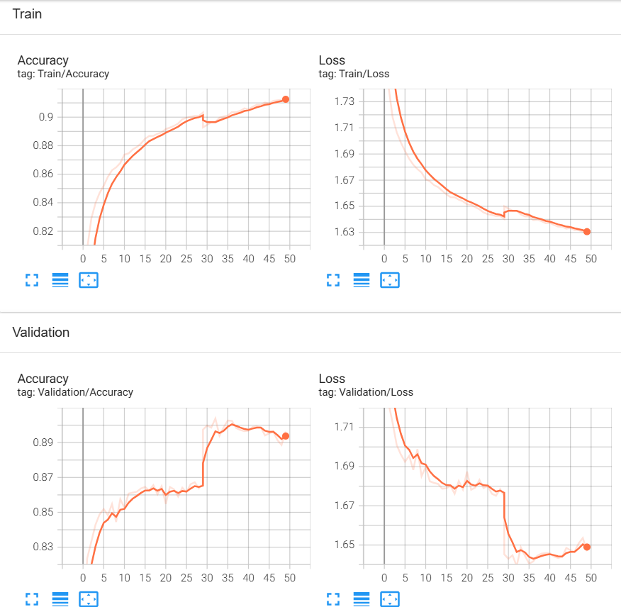

# Hand Draw Project
## Introduction
Hand Draw sử dụng mô hình học sâu CNN để nhận diện các hình vẽ được tạo bằng tay trong thời gian thực. Sử dụng camera để theo dõi chuyển động của bàn tay người dùng, ghi lại đường vẽ và nhận diện hình dạng được tạo ra.

## How it works?
- Phát hiện bàn tay: Sử dụng MediaPipe để phát hiện và theo dõi vị trí của bàn tay trong khung hình camera.
- Ghi lại đường vẽ: Khi di chuyển ngón trỏ, ghi lại các điểm và vẽ các đường nối.
- Nhận diện: Sau khi hoàn thành đường vẽ, sử dụng mô hình CNN để nhận diện hình dạng.
- Hiển thị kết quả: Kết quả nhận class diện được hiển thị trên màn hình.

## Preview
https://github.com/user-attachments/assets/5a390c8d-23f9-47cd-b49d-840a4e5d8ca8

## Dataset
Sử dụng 10 class trong bộ
[**Quickdraw Datasets**](https://quickdraw.withgoogle.com/data) của Google

|airplane|ant|apple|axe|banana|
|---|---|---|---|---|
|**barn**|**baseball**|**basket**|**basketball**|**bat**|

### Validation

## Requirements
- Python 3.12
- MediaPipe
- OpenCV
- Pytorch
